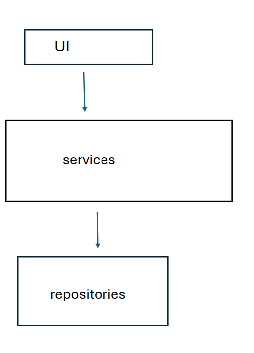
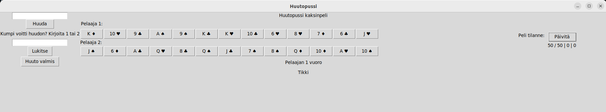
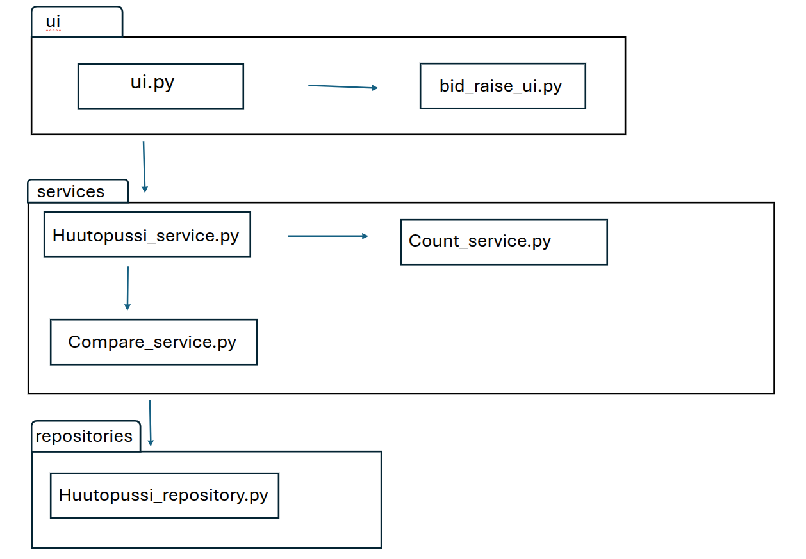
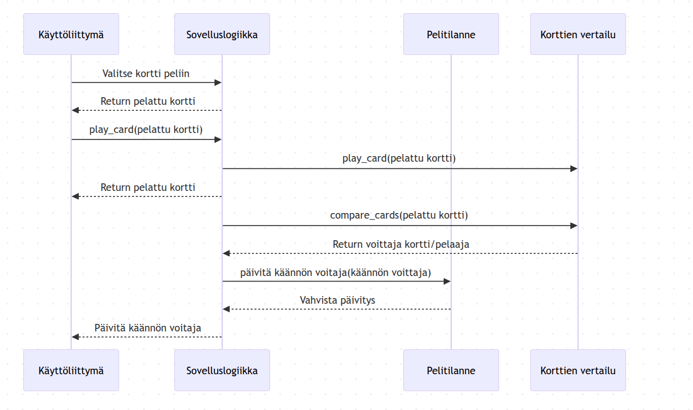

# Arkkitehtuurikuvaus
Sovellus on digiversio Huutopussi-pelistä kahdelle pelaajalle. 

## Rakenne
Pakkausrakenne:

 

## Käyttöliittymä

`ui.py` ja `bid_raise_ui.py` sisällyttää käyttöliittymän, joka vastaa pelin näkymien toiminnasta. Pelaajat tekevät vuorotellen tarjouksia korteistaan. Ui.py sisällyttää tarjouskierroksen ja pelin kulun. 
 

## Sovelluslogiikka

Pelin toiminnallisuuksista vastaa `huutopussi_service.py`, `compare_service.py` ja `count_service.py`.

Rakennetta vastaava pakkaus/luokka kaavio:
 

## Tietokantatallennus

Tietojen tallennus tapahtuu tietokantaan, joka luodaa pelin alussa. Tämä mahodollistaa pisteiden laskun pelin sisällä. 

### Tiedostot

`repositories` -luokka vastaa tietojen tallennuksesta.

## Päätoiminnallisuudet
Tarjousvaihe -  Pelaajat tekevät tarjouksia pisteistä, jotka pelaajat uskovat saavansa.

Pisteiden laskenta - Pelin lopussa lasketaan pisteet ja tarkistetaan, saiko tarjousvaiheen voittaja huutonsa.

### Kortin pelaaminen

Tikin pelaaminen - Pelaajat pelaavat kortteja vuorotellen, tikin voittaja määräytyy pelin sääntöjen mukaan. Kortin pelaaminen tapahtuu painamalla haluttua korttia.

  

### Muut toiminnallisuudet

Ohjelman muut toiminnalisuudet on toteutettu samalla logiikalla kuin aiemmin kuvattu.

## Ohjelmarakenteen heikkoudet

Ohjelma on altis ns. "väärin pelaamiselle". Myös pelaajat voisivat olla oma luokka.
