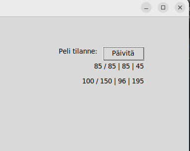

# Käyttöohje 

# Käynnistysohje: 

1. Pelin riippuvuudet asennetaan komennolla:

```bash
poetry install
```

2. Luo tiedosto .env samaan kansioon kuin tämä projekti.

    .env tiedostoon luo tietokannan nimi. Huom. nimen täytyy loppua .sqlite
```bash
 DATABASE_FILENAME=
``` 

3. Alusta sovelluksen tietokanta komennolla:

 ```bash
poetry run invoke build
```

4. Käynnistä sovellus komennolla:

```bash
poetry run invoke start
```

## Pelin idea: 

Peli koostuu kierroksista, joilla kerätään pisteitä. Yhdelllä kierroksella on tarkoitus ensin “huutaa” eli tarjota pisteitä, jotka luulee saavansa omista korteista. Tämän jälkeen kortit pelataan ja katsotaan saiko huutaja pisteensä. Ensin 500  pistettä kerännyt voittaa pelin. Tähän menee useampi kierros. 

## Pelin kulku: 

Peli alkaa tarjouskierroksesta: 

 

Pelaajat vuorotellen ” huutavat” pistemääristä kirjoittamalla huudon ensimmäiseen kenttään ja painamalla “Huuda”. Kun toinen pelaaja luovuttaa huudon, kirjoitetaan eniten huutaneen pelaajan numero alempaan kenttään ja painetaan “Lukitse” ja “Huuto valmis”. 
Huudon voittanut saa itselleen neljä korttia lisää, jonka jälkeen hänellä on mahdollisuus vielä korottaa huutoa kirjoittamalla korotuksen kenttään ja painamalla “Korota”. Kun korotus on lopullinen, paina vielä “Lukitse”: 

 

Tämän jälkeen tarjouskierroksen voittanut pelaaja laittaa pois neljä korttia. Nämä pisteet tulevat hänelle itselleen. Tässä laitettu jo neljä korttia pois: 

 

Tämän jälkeen tikkipeli alkaa. Pelaajat pelaavat vuorotellen kortin (näkyyviin "Tikki" alle). Pelissä on "maapakko" eli täytyy pelata samaa maata kuin toinen, jos on. 
Tikin voittaa pelaaja, joka laittaa suuremman kortin.

Korttien arvojärjestys on 6 < 7 < 8 < 9 < J < Q < K < 10 < A. 

## Valtti:

Valtin voi tehdä omalla vuorollaan, kun omissa korteissa on samaa maata K + Q. Toisen vuorolla tehty valtti tuo vastapelaajalle pisteet. Valteista saa seuraavasti pisteitä: pata = 40, risti = 60, ruutu = 80 ja hertta = 100. 

## Pisteet pelissä:
Kortit tuottavat tikin voitajalle seuraavasti pisteitä: kortit 6-9 -> 0p., J = 2p., Q = 3p., K = 4p., 10 = 10p. ja A = 11p.. Viimeisen tikin voittaja saa extra +20p. 

## Pelitilanne: 

Pelitilanteen voi tarkistaa painamalla “Päivitä” -nappia. Tämä kertoo ensin huudon ja korotuksen (H/K), sitten pelaajan 1 ja 2 pisteet. Esim:

 

## Huomioitavaa pelaamisesta

Samasta kädestä ei voi pelata kahta korttia, muuten peli lukkiutuu.
Pelin lukkiutuessa paina oikeassa yläkulmassa olevaa rastia ja aloita peli uudestaan.
