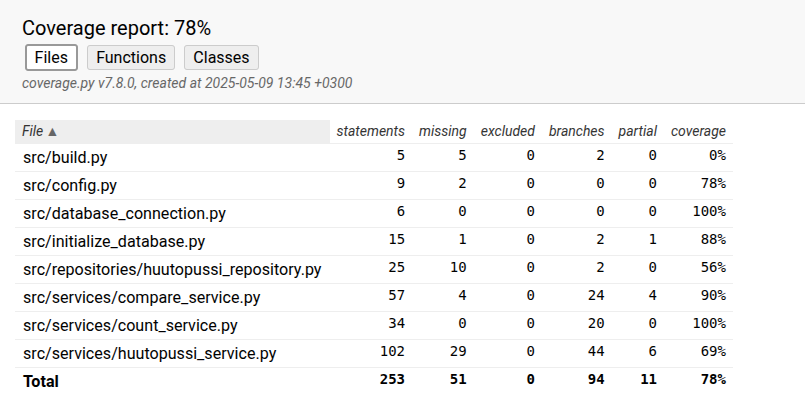

# Testausdokumentti
Ohjelmalle on suoritettu automatisoituja testejä Unittest -kirjastolla, näiden lisäksi ohjelmaa on testattu myös manuaalisesti. Nämä testit kattavat sovelluslogiikan tärkeimmät osat; sovelluslogiika eli pelin kulun ja pisteenlaskennan.

## Yksikkö- ja integraatio testaus

### Sovelluslogiikka

`HuutopussiService` -luokkaa testataan [TestHuutopussiService](/src/tests/services/huutopussi_service_test.py)-testiluokalla.

`CompareService` -luokkaa testataan [TestCompareService](/src/tests/services/compare_service_test.py)-testiluokalla. Tässä testataan, että tajousvaiheen pisteet tulevat oikein, ja huudon "voittanut" aloittaa pelin.

`CountService` -luokkaa testataan [TestCountService](/src/tests/services/count_service_test.py)-testiluokalla. Tässä varmistetaan, että pisteet lasketaan sääntöjen mukaisesti oikein.

### Repositorio-luokat

`HuutopussiRepository` -luokkaa ei toistaiseksi testata itsenäisesti.
### Testauskattavuus

Pelin haarautumiskattavuus on 78%. Tässä ei ole huomiotu käyttöliittymäkerrosta.

 

## Järjestelmätestaus
Käyttöliittymää on testattattu manuaalisesti.

### Ohjelman asennus ja konfigurointi

Sovelluksen tietokannan luontia on testattu tilanteessa, jossa tietokantaa ei ole vielä olemassa.

### Toiminaalisuudet
Kaikkia toiminnallisuuksia ei ole testattu väärillä syötteillä. Sääntöjen vastainen korttien pelaaminen eli ns. "maapakko" on testattu . Testaamatta on tarjouskierroksen kentät. Näitä on testattu vain manuaalisesti.

## Jääneet laatuongelmat

Repository luokkien testaus ja tietokannan automaatiotestit. Testikattavuus sovelluslogiikalle voisi olla suurempi.