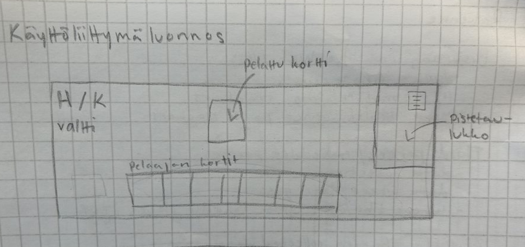

# Vaatimusmäärittely 

## Sovelluksen tarkoitus 

Sovelluksella voi pelata huutopussin kaksinpeliversiota, jossa pelaajilla on 13 	korttia kädessä, 4 korttia huudettavana ja 6 korttia muodostaa “pirunpakan”. 

## Käyttöliittymäluonnos 

 

## Suunnitellut toiminnallisuudet 

### Sovelluksen ydin 

Peliä pystyy pelaamaan 

- Korttien jako toimii 
- Huutovaihe toimii 
- Pisteenlasku toimii 

### Lisää toiminnalisuuksia 

- Pelaajat eivät näe toistensa kortteja
  - Pelivuoron vaihdossa pelaajat eivät näe toistensa kortteja
- Pelin pistetaulukko 
- Kortteja ei pysty pelata sääntöjen vastaisesti 

 

## Jatkokehitysideoita 

- Kolmin tai nelinpeli 
- Peliä pystyy pelaamaan kahdella eri koneella samaan aikaan 
