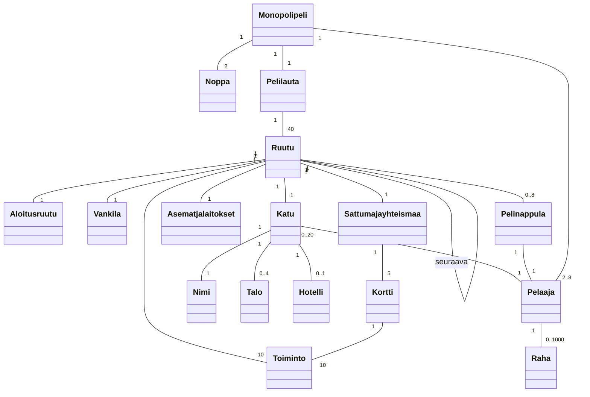

## Monopoli, luokkakaavio

```mermaid
 classDiagram
    Monopolipeli "1" -- "2" Noppa
    Monopolipeli "1" -- "1" Pelilauta
    Pelilauta "1" -- "40" Ruutu
    Ruutu "1" -- "1" Ruutu : seuraava
    Ruutu "1" -- "10" Toiminto
    Ruutu "1" -- "1" Aloitusruutu
    Ruutu "1" -- "1" Vankila
    Ruutu "1" -- "1" Sattuma ja yhteismaa
    Sattuma ja yhteismaa "1" -- "5" Kortti
    Kortti "1" -- "10" Toiminto
    Ruutu "1" -- "1" Asemat ja laitokset
    Ruutu "1" -- "1" Katu
    Katu "1" -- "1" Nimi
    Katu "1" -- "0..4" Talo
    Katu "1" -- "0..1" Hotelli
    Katu "0..20" -- "1" Pelaaja
    Ruutu "1" -- "0..8" Pelinappula
    Pelinappula "1" -- "1" Pelaaja
    Pelaaja "1" -- "0..1000" Raha
    Pelaaja "2..8" -- "1" Monopolipeli
```