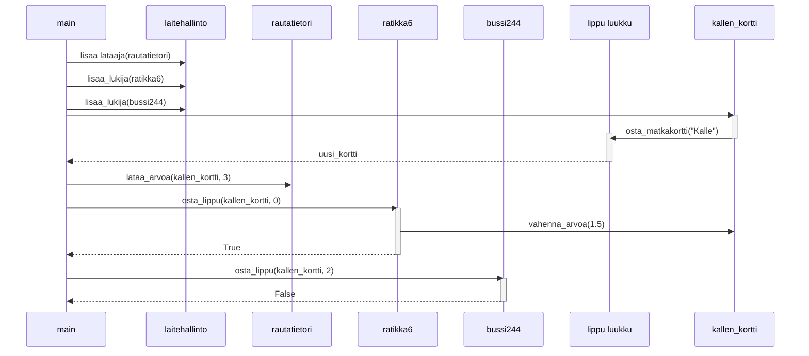

## HSL, sekvenssikaavio

```mermaid
 sequenceDiagram

    participant main
    participant laitehallinto
    participant rautatietori
    participant ratikka6
    participant bussi244
    participant lippu luukku
    participant kallen_kortti

    main->>laitehallinto: lisaa lataaja(rautatietori)
    main->>laitehallinto: lisaa_lukija(ratikka6)
    main->>laitehallinto: lisaa_lukija(bussi244)

    main->>kallen_kortti: 
    activate kallen_kortti
    kallen_kortti->>lippu luukku: osta_matkakortti("Kalle")
    activate lippu luukku
    deactivate kallen_kortti
    lippu luukku-->>main: uusi_kortti
    deactivate lippu luukku

    main->>rautatietori: lataa_arvoa(kallen_kortti, 3)

    main->>ratikka6: osta_lippu(kallen_kortti, 0)
    activate ratikka6
    ratikka6->>kallen_kortti: vahenna_arvoa(1.5)
    ratikka6-->>main: True
    deactivate ratikka6

    main->>bussi244: osta_lippu(kallen_kortti, 2)
    activate bussi244
    bussi244-->>main: False
    deactivate bussi244
```